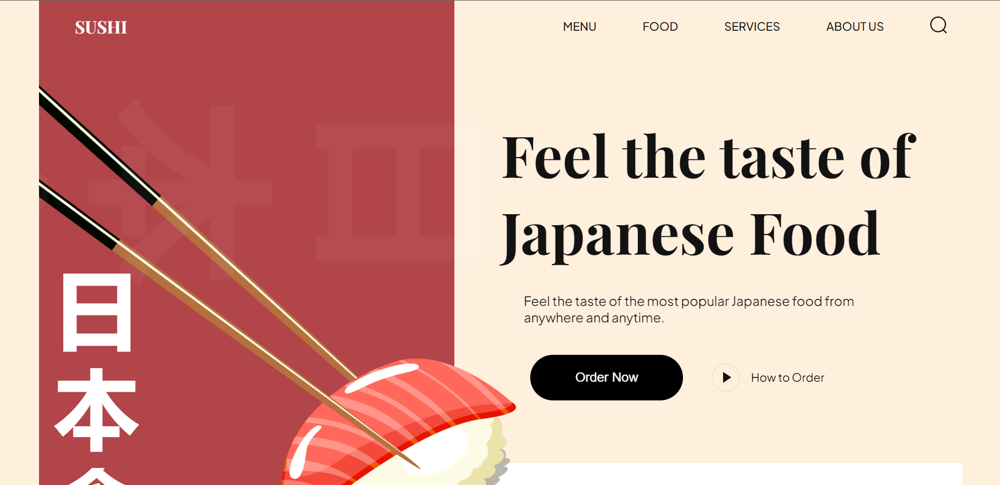
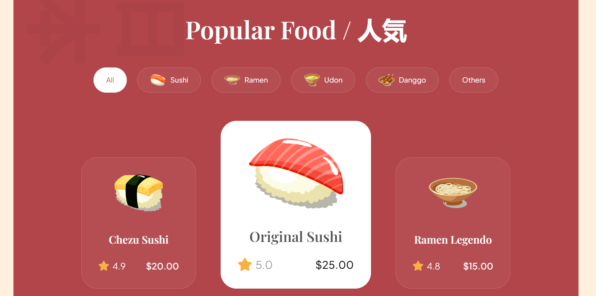
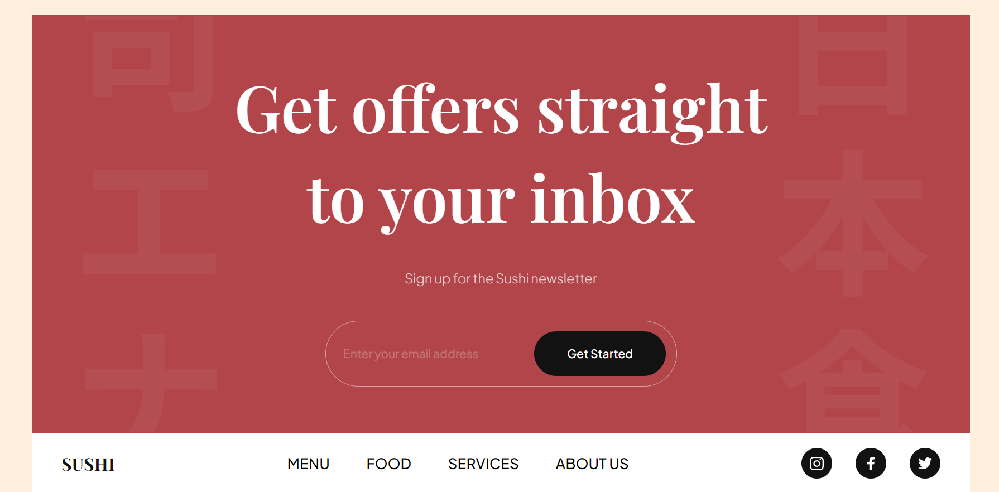

# Sushi Store

## About
A Sushi Store website using HTML and CSS (using Vite).

## Installation

1. Clone the repository

    ```bash
    git clone https://github.com/0xSravan03/sushi-website.git
    cd sushi-website
    ```
2. Install dependency

    ```bash
    npm install
    ```
## Run development server
```bash
npm run dev
```
Open http://localhost:5173 with your browser to see the result.


## Demo

https://my-sushi-store.vercel.app/


## Screenshots






## My Learnings

1. Setup a Nextjs 13 project with typescript
2. Use new app router feature
3. Client side components & Server side components
